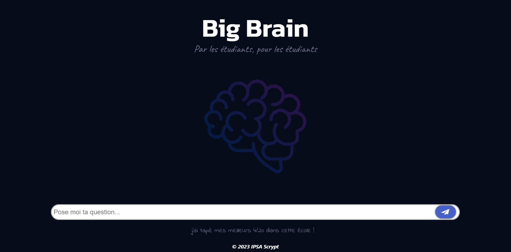

    
    
    
    

# Big Brain Website

Welcome to the Big Brain website repository! This is where we store all of our website code.
The goal of this website is to provide a place for students to gather resources using a simple and easy to use interface.

# Scope

For now, only IPSA (French engineering school) students can access the website. However, we plan on making it available to more schools in the future.

# Built with

The website is built using the following technologies:

- [TypeScript](https://www.typescriptlang.org/)
- [Node.js](https://nodejs.org/en/)
- [React](https://reactjs.org/)
- [Vite](https://vitejs.dev/)

# Linter from

- [ESLint](https://eslint.org/)
- [discord.js](https://github.com/discordjs/discord.js)

# Acknowledgements

- [Phearion](https://github.com/Phearion) for the idea and the base code for everything related to Big Brain Project.
- Professor [Aybuke Ozturk](https://www.aybukeozturk.com)
- [IPSA](https://www.ipsa.fr/) 👀
